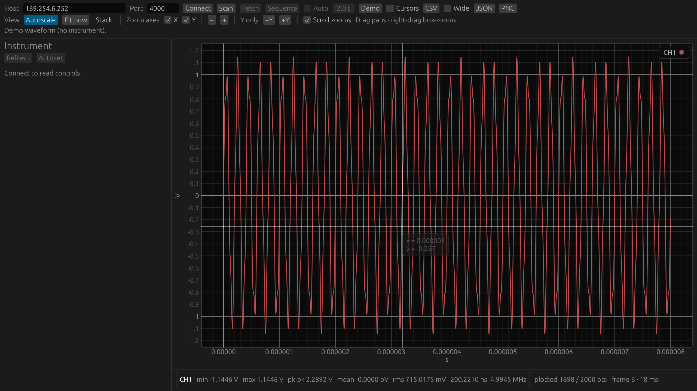

# instrument-viewer

<p align="center">
  
</p>

[](https://github.com/leftger/instrument-viewer/actions/workflows/ci.yml)
[](LICENSE-MIT)

Rust GUI that pulls analog traces from Tektronix **MDO3000** and Rigol
**DHO900** oscilloscopes over SCPI TCP and plots them. It also controls a
Siglent **SDG1032X** generator and Keysight **E36200** supplies (socket port
5025). USB **USBTMC** instruments are supported too, with no NI-VISA.

---

## Supported instruments

| Instrument | Role | SCPI port |
| :--- | :--- | :---: |
| Tektronix MDO3000 | Oscilloscope | 4000 |
| Rigol DHO900 | Oscilloscope | 5555 |
| Siglent SDG1032X | Waveform generator | 5025 |
| Keysight E36231A / E36233A | DC supplies | 5025 |
| Tektronix AFG3000 | Waveform generator | 4000 |
| Siglent SDS1000X-E | Oscilloscope | 5025 |

The backend is selected automatically from the `*IDN?` reply, so controls adapt
to the instrument. Any instrument can also be added as a YAML profile without
Rust code — see [Instrument profiles](profiles/README.md).

---

## Quick start

<p align="center">
  
</p>

```bash
cargo run --release
```

**Connect**, then **Fetch**, tick **Auto**, or use **Sequence**. **CSV** /
**JSON** / **PNG** export the plotted traces, and **Cursors** measure Δt and
1/Δt. No instrument at hand? **Demo** plots a synthetic sine. The screenshot
above is reproducible from the app itself:

```bash
cargo run --release -- --screenshot assets/screenshot.png
```

---

## Highlights

- Live plotting with min/max decimation, autoscale, stacked channel bands, zoom, pan, and box-zoom
- Automatic backend selection from `*IDN?`; unsupported settings are hidden or read-only
- Discovery over mDNS LXI, ARP neighbors, and USBTMC (no NI-VISA)
- Full CLI: read/configure channels, timebase, trigger, acquisition, raw SCPI, and CSV/JSON export
- Headless `selftest` and raw `probe` example for isolating app bugs from instrument bugs

---

## Documentation

| Guide | Covers |
| :--- | :--- |
| [Using the GUI](docs/gui.md) | Toolbar, plot and view controls, channel panel, preferences, rendering notes |
| [Instrument setup](docs/instrument-setup.md) | Per-instrument network setup, ports, discovery and connection |
| [CLI control](docs/cli.md) | All subcommands, export formats, headless checks |
| [Protocol & quirks](docs/protocol.md) | SCPI transfer and scaling details, Tektronix quirks, Rigol DHO900 notes |
| [Instrument profiles](profiles/README.md) | Adding instruments as YAML without Rust code |

---

## Not implemented

USB CDC-only gadgets (not USBTMC), digital-channel setup, non-edge triggers, and RF/spectrum controls.

---

## License

Dual-licensed under either of:

- **MIT License** ([`LICENSE-MIT`](./LICENSE-MIT))
- **Apache License, Version 2.0** ([`LICENSE-APACHE`](./LICENSE-APACHE))

at your option.
